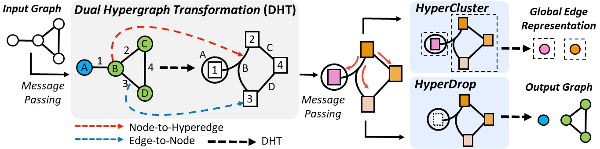

# Edge Representation Learning with Hypergraphs

Official Code Repository for the paper "Edge Representation Learning with Hypergraphs" (NeurIPS 2021): https://arxiv.org/abs/2106.15845.

In this repository, we implement the *Dual Hypergraph Transformation* (DHT) and two edge pooling methods *HyperDrop* and *HyperCluster*.


<p align="center">
    
</p>

### Contribution

+ We introduce a novel edge representation learning scheme using Dual Hypergraph Transformation, which exploits the dual hypergraph whose nodes are edges of the original graph, on which we can apply off-the-shelf message-passing schemes designed for node-level representation learning.
+ We propose novel edge pooling methods for graph-level representation learning, namely HyperCluster and HyperDrop, to overcome the limitations of existing node-based pooling methods.
+ We validate our methods on graph reconstruction, generation, and classification tasks, on which they largely outperform existing graph representation learning methods.


## Dependencies

+ Python 3.7.0
+ Pytorch 1.4.0
+ Pytorch Geometric 1.4.3

## Training and Evaluation

We provide the commands for the following tasks: Graph Reconstruction and Graph Classification

For each command, the first argument denotes the gpu id and the second argument denotes the experiment number.

+ Edge Reconstruction on the ZINC dataset

```sh
sh ./scripts/reconstruction_ZINC.sh 0 000
```

+ Graph Classification on TU datasets

```sh
sh ./scripts/classification_TU.sh 0 000
```

+ Graph Classification on OGB datasets

```sh
sh ./scripts/classification_OGB.sh 0 000
```

## Citation

If you found the provided code with our paper useful in your work, we kindly request that you cite our work.

```BibTex
@inproceedings{jo2021ehgnn,
  author    = {Jaehyeong Jo and
               Jinheon Baek and
               Seul Lee and
               Dongki Kim and
               Minki Kang and
               Sung Ju Hwang},
  title     = {Edge Representation Learning with Hypergraphs},
  booktitle = {Advances in Neural Information Processing Systems 34: Annual Conference
               on Neural Information Processing Systems 2021, NeurIPS 2021, December
               6-14, 2021, virtual},
  pages     = {7534--7546},
  year      = {2021}
}
```